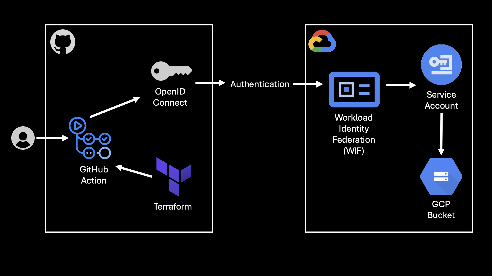

# Bootstrap WIF (Workload Identity Federation) Script Guide



## Overview

The `bootstrap_wif.sh` script sets up secure authentication between GitHub Actions and Google Cloud Platform using Workload Identity Federation (WIF). This eliminates the need for long-lived service account keys by using OpenID Connect (OIDC) tokens.

## What It Creates

### 1. Service Account
- **Purpose**: Acts as the identity for GitHub Actions in GCP
- **Naming**: `gha-deployer-{random-suffix}@{project-id}.iam.gserviceaccount.com`
- **Permissions**:
  - `roles/storage.objectViewer` - View objects in all storage buckets
  - Custom role `bucketCreator_{random-suffix}` - Manage storage buckets

### 2. Custom IAM Role
- **Role ID**: `bucketCreator_{random-suffix}`
- **Title**: Bucket Manager
- **Permissions**:
  - `storage.buckets.create` - Create new storage buckets
  - `storage.buckets.list` - List existing buckets
  - `storage.buckets.get` - Read bucket metadata (required for Terraform state refresh)
  - `storage.buckets.update` - Update bucket configuration
  - `storage.buckets.delete` - Delete storage buckets (required for Terraform destroy/replace)
- **Purpose**: Follows principle of least privilege vs using broad `storage.admin`

### 3. Workload Identity Pool
- **Purpose**: Container for external identity providers
- **Naming**: `gh-pool-{random-suffix}`
- **Location**: Global
- **Function**: Groups identity providers and defines trust relationships

### 4. OIDC Provider (GitHub)
- **Purpose**: Establishes trust with GitHub's OIDC issuer
- **Naming**: `github-{random-suffix}`
- **Issuer URI**: `https://token.actions.githubusercontent.com`
- **Attribute Mapping**: Maps GitHub token claims to GCP attributes

### 5. Terraform State Bucket
- **Purpose**: Stores Terraform state files securely
- **Naming**: `tfstate-{random-suffix}`
- **Features**: 
  - Versioning enabled
  - Uniform Bucket Level Access (UBLA)
  - Service account has `storage.objectAdmin` permissions

## Configuration Variables

### Required
- `PROJECT_ID`: Your GCP project ID
- `REPO`: GitHub repository in format `owner/repo`

### Optional
- `BRANCH`: Git reference to trust (default: `refs/heads/main`)
- `REPO_OWNER`: Repository owner (derived from REPO by default)
- `PROVIDER_SCOPE`: Trust scope - `owner|repo|repo-ref` (default: `owner`)
- `STATE_BUCKET_LOCATION`: Bucket location (default: `europe-west2`)
- `CREATE_TFSTATE`: Create state bucket (default: `1`)

## Security Scopes

### Owner Scope (Default)
```bash
PROVIDER_SCOPE="owner"
```
- **Provider condition**: `attribute.repository_owner=='owner-name'`
- **SA condition**: `request.auth.claims['repository_owner']=='owner-name'`
- **Access**: Any repository under the specified owner

### Repository Scope
```bash
PROVIDER_SCOPE="repo"
```
- **Provider condition**: `attribute.repository=='owner/repo'`
- **SA condition**: `request.auth.claims['repository']=='owner/repo'`
- **Access**: Only the specific repository

### Repository + Reference Scope
```bash
PROVIDER_SCOPE="repo-ref"
```
- **Provider condition**: `attribute.repository=='owner/repo' && attribute.ref=='refs/heads/main'`
- **SA condition**: `request.auth.claims['repository']=='owner/repo' && request.auth.claims['ref']=='refs/heads/main'`
- **Access**: Only specific repository and branch/tag

## Usage Examples

### Basic Setup
```bash
PROJECT_ID="my-project" REPO="myorg/myrepo" ./bootstrap_wif.sh
```

### Repository-Scoped Access
```bash
PROJECT_ID="my-project" REPO="myorg/myrepo" PROVIDER_SCOPE="repo" ./bootstrap_wif.sh
```

### Branch-Specific Access
```bash
PROJECT_ID="my-project" REPO="myorg/myrepo" PROVIDER_SCOPE="repo-ref" BRANCH="refs/heads/production" ./bootstrap_wif.sh
```

### Custom Bucket Location
```bash
PROJECT_ID="my-project" REPO="myorg/myrepo" STATE_BUCKET_LOCATION="us-central1" ./bootstrap_wif.sh
```

## Script Flow

1. **Validation**: Checks required tools and parameters
2. **API Enablement**: Enables required GCP APIs
3. **Custom Role Creation**: Creates or updates custom role with bucket management permissions
4. **Service Account**: Creates or validates service account
5. **IAM Binding**: Grants roles to service account (with 2s delay for propagation)
6. **Workload Identity Pool**: Creates identity pool
7. **OIDC Provider**: Creates GitHub OIDC provider with attribute conditions
8. **Service Account Binding**: Binds SA to WIF with repository conditions
9. **Token Creator Permission**: Grants Workload Identity Pool the ability to generate access tokens for the service account
10. **SA Self-Impersonation**: Allows service account to impersonate itself (for backward compatibility)
11. **State Bucket**: Optionally creates Terraform state bucket
12. **Output**: Displays configuration values for GitHub Actions

## Outputs

The script provides these values for your GitHub repository:

### Repository Variables
```
GCP_PROJECT_ID=your-project-id
GCP_PROJECT_NUMBER=123456789
TF_STATE_BUCKET=tfstate-12345
```

### Workflow Configuration
```yaml
- uses: google-github-actions/auth@v2
  with:
    token_format: 'access_token'  # Required for generating OAuth2 access tokens
    workload_identity_provider: projects/123/locations/global/workloadIdentityPools/gh-pool-12345/providers/github-12345
    service_account: gha-deployer-12345@your-project.iam.gserviceaccount.com
    export_environment_variables: true
```

## Attribute Mapping

The script maps GitHub OIDC token claims to GCP attributes:

| GitHub Claim | GCP Attribute | Description |
|--------------|---------------|-------------|
| `sub` | `google.subject` | Subject identifier |
| `actor` | `attribute.actor` | GitHub username |
| `repository` | `attribute.repository` | Repository name |
| `repository_owner` | `attribute.repository_owner` | Repository owner |
| `ref` | `attribute.ref` | Git reference |
| `workflow` | `attribute.workflow` | Workflow name |
| `sha` | `attribute.sha` | Commit SHA |

## Security Features

### Principle of Least Privilege
- Custom role with minimal bucket permissions
- Scoped access based on repository/owner/branch
- No long-lived keys

### Conditional Access
- Provider-level attribute filtering
- Service account-level claim validation
- Both conditions must match for access

### Audit Trail
- All actions logged in GCP audit logs
- GitHub Actions logs show authentication details
- Service account usage tracked

## Troubleshooting

### Common Issues

1. **Service Account Not Found Error**
   - Solution: Script includes 2-second delay after SA creation
   - Retry: Script is idempotent, safe to re-run

2. **Custom Role Already Exists**
   - Behavior: Script continues with existing role
   - Safe: No conflicts with existing deployments

3. **Permission Denied**
   - Check: Ensure you have `roles/owner` or equivalent on the project
   - Required: IAM, Storage, and Service Account admin permissions

4. **iam.serviceAccounts.getAccessToken Permission Denied**
   - Cause: Missing Service Account Token Creator role for Workload Identity Pool
   - Solution: The bootstrap script now automatically grants this permission
   - Manual Fix: Run `gcloud iam service-accounts add-iam-policy-binding SA_EMAIL --role="roles/iam.serviceAccountTokenCreator" --member="principalSet://iam.googleapis.com/projects/PROJECT_NUMBER/locations/global/workloadIdentityPools/POOL_ID/*" --condition=None`

### Verification

Check the setup worked:
```bash
# Verify service account
gcloud iam service-accounts describe SA_EMAIL

# Verify custom role
gcloud iam roles describe bucketCreator --project PROJECT_ID

# Verify workload identity pool
gcloud iam workload-identity-pools describe POOL_ID --location global

# Verify provider
gcloud iam workload-identity-pools providers describe PROVIDER_ID \
  --workload-identity-pool POOL_ID --location global

# Verify service account IAM bindings (should show both workloadIdentityUser and serviceAccountTokenCreator)
gcloud iam service-accounts get-iam-policy SA_EMAIL --project PROJECT_ID
```

## Cleanup

Use the companion `cleanup.sh` script to remove all resources:

```bash
./cleanup.sh PROJECT_ID SA_NAME POOL_ID PROVIDER_ID BUCKET_NAME
```

The cleanup script:
1. Removes IAM bindings before deleting service account
2. Deletes custom role
3. Removes workload identity provider and pool
4. Deletes Terraform state bucket
5. Verifies all resources are cleaned up

## Best Practices

### For Production
1. Use `repo-ref` scope for specific branch protection
2. Set shorter token lifetimes in workflows
3. Regularly rotate random suffixes
4. Monitor service account usage
5. Use separate projects for different environments

### For Development
1. Use `owner` scope for convenience
2. Test with non-production projects first
3. Clean up test resources regularly
4. Document the setup for team members

## Integration with Terraform

The script creates a service account that can:
- Create storage buckets via Terraform
- Manage Terraform state in the created bucket
- Deploy other GCP resources (with additional roles)

Example Terraform backend configuration:
```hcl
terraform {
  backend "gcs" {
    bucket = "tfstate-12345"  # From script output
    prefix = "terraform/state"
  }
}
```